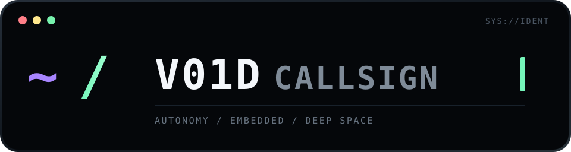
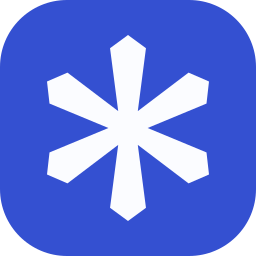

<table>
  <tr>
    <td width="32%" align="center" valign="middle">
      
    </td>
    <td width="68%" align="center" valign="middle">
      
    </td>
  </tr>
</table>

```console
void@lab:~$ whoami
student engineer // software · hardware · physics
building systems that sense, decide, and occasionally refuse to cooperate
```

### `// stack`

<p align="center">
  
  
  
  
  
  
  
  
  
  
  <br>
  
  
  
  
  
  
  
  
  
  
</p>

### `// signal`

```text
[01] autonomous systems       [05] machine learning
[02] embedded electronics     [06] physics / exoplanets
[03] computer vision          [07] CAD / 3D printing
[04] software engineering     [08] photography
```

### `// currently`

```yaml
learning:  [autonomous robotics, embedded systems, perception]
building:  engineering experiments
watching:  transit curves, sensor noise, compiler warnings
status:    operational
```
