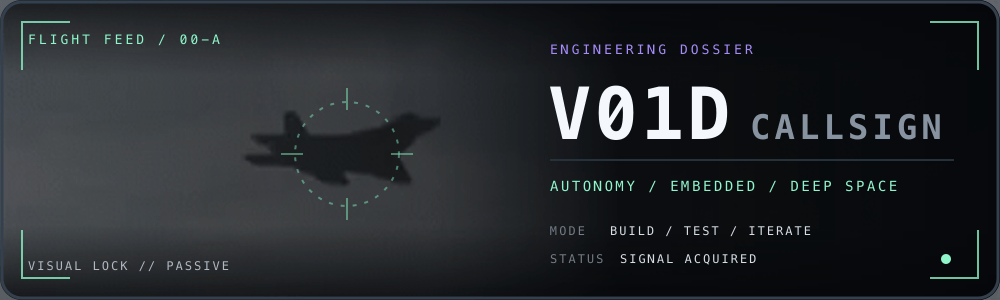

  

  <code>STUDENT ENGINEER</code>
  &nbsp;·&nbsp;
  <code>SOFTWARE × HARDWARE × PHYSICS</code>
  &nbsp;·&nbsp;
  <code>ARCH, BTW</code>

## onboard systems

<table>
  <tr>
    <td width="16%"><code>LANG</code> things I speak</td>
    <td width="84%">
      
      
      
      
      
      
      
      
    </td>
  </tr>
  <tr>
    <td><code>BUILD</code> ship + scale</td>
    <td>
      
      
      
      
      
      
      
    </td>
  </tr>
  <tr>
    <td><code>HOST</code> daily machinery</td>
    <td>
      
      
      
      
      
      
      
      
    </td>
  </tr>
  <tr>
    <td><code>BENCH</code> atoms included</td>
    <td>
      
      
      
      
    </td>
  </tr>
</table>

## active vectors

<table>
  <tr>
    <td width="7%"><code>01</code></td>
    <td width="43%"><strong>electrical engineering</strong> circuits / signals / embedded</td>
    <td width="7%"><code>02</code></td>
    <td width="43%"><strong>machine learning</strong> perception / inference</td>
  </tr>
  <tr>
    <td><code>03</code></td>
    <td><strong>physics + exoplanets</strong> light curves / transit signals</td>
    <td><code>04</code></td>
    <td><strong>CAD</strong> parts that should fit the first time</td>
  </tr>
  <tr>
    <td><code>05</code></td>
    <td colspan="3"><strong>autonomous systems</strong> perception → planning → control</td>
  </tr>
</table>
